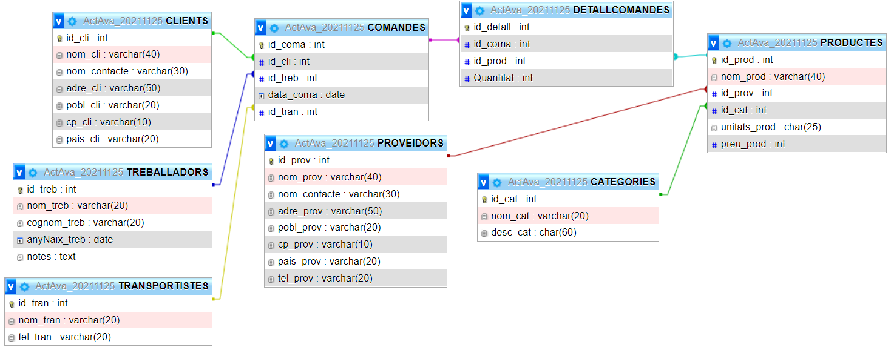

# Act. Aval.: 25 de novembre 2012
## **MP02**: Base de Dades - **UF02**: Llenguatges SQL: DML i DDL

<br>

## **Requeriments**
<hr>

Aquesta activitat cal fer-la en local al vostre ordinador, i fent servir la **màquina virtual** que fem servir a classe, i a on teniu instal·lat el **```docker```** i un **contenidor** amb **```mysql```** creat.

Recordatori de les comandes per crear el contenidor, si no el teniu ja creat.
> *```sudo docker run --name ```*  **```<nomContenidor>```** *```-e MYSQL_ROOT_PASSWORD=12345 -d  mysql:latest```*
> <br><br>

 a on **```<nomContenidor>```** és el nom del vostre contenidor.

Comanda per accedir al contenidor:
>&nbsp;&nbsp;*```$```* **```sudo docker exec -ti jpc-mysql bash```** 
>
>&nbsp;&nbsp;*```root@25eb09e8df2c:/#```*&nbsp;&nbsp;&nbsp;**```mysql -u root -p```**
>
>&nbsp;&nbsp;```Enter password:``` &nbsp;&nbsp;*12345*
>
>&nbsp;&nbsp;```Welcome to the MySQL monitor.  Commands end with ; or \g.``` 
>
>&nbsp;&nbsp;```Your MySQL connection id is 46``` 
>
>&nbsp;&nbsp;```Server version: 8.0.27 MySQL Community Server - GPL``` 
>
>&nbsp;&nbsp;```Copyright (c) 2000, 2021, Oracle and/or its affiliates.``` 
>
>&nbsp;&nbsp;**```Oracle is a registered trademark of Oracle Corporation and/or its
affiliates. Other names may be trademarks of their respective
owners.```**
>
>&nbsp;&nbsp;**```Type 'help;' or '\h' for help. Type '\c' to clear the current input statement.```**
>
>&nbsp;&nbsp;**```mysql> ```**

<br>

## **Pasos previs**
<hr>

1. Abans de començar, cal que cloneu aquest repositori a un repositori local al vostre ordinador.

    >  **```$ sudo git clone https://github.com/joanpardogine/DAW_MP02_020_UF02_Act_Ava_20211125.git```**


1. Recordeu que la comanda ***```clone```*** us ha creat un enllaç anomenat ***```origin```***,

1. Ho podeu comprobar executant la comanda:

    >  **```$ git remote get-url origin ```**
    >  **```https://github.com/joanpardogine/DAW_MP02_020_UF02_Act_Ava_20211125.git```**

1. Ara, cal que elimineu l'enllaç anomenat ***```origin```***, abans de continuar.

    >  **```$ git remote remove origin ```**

<br>

### Arribats a aquest punt, ja podeu començar. 
<hr>

1. Cal que creeu un repositori al vostre compte de **```github.com```**, amb els següents detalls:
    1. Amb el **nom** del **repositori remot**: ***```<CognomAlumne><NomAlumne>```*```_ActAva_20211125```**
    1. El **repositori remot** cal que sigui de tipus ***```privat```***.
    1. Cal que convideu a l'usuari ***```joanpardogine```***




